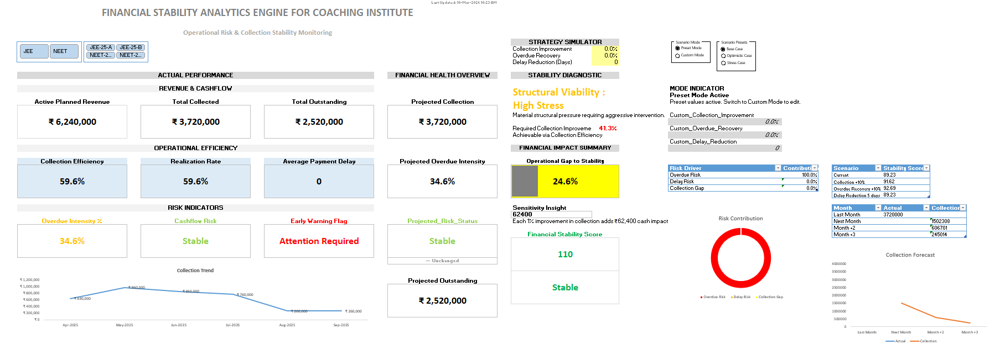
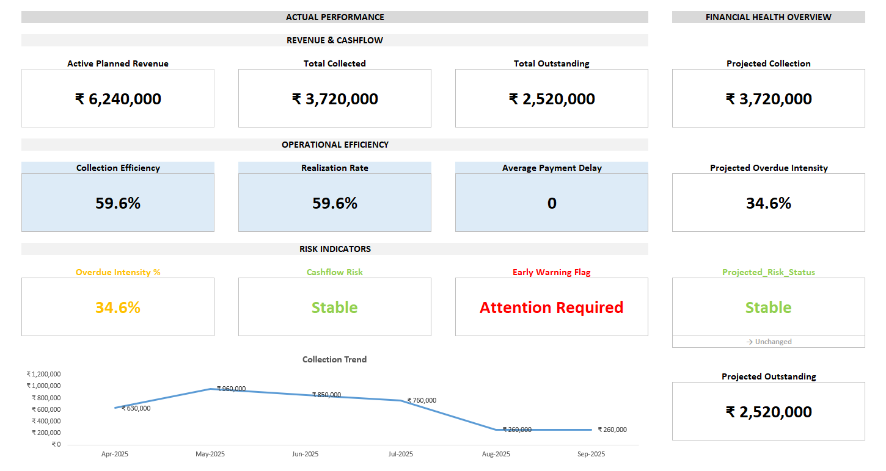
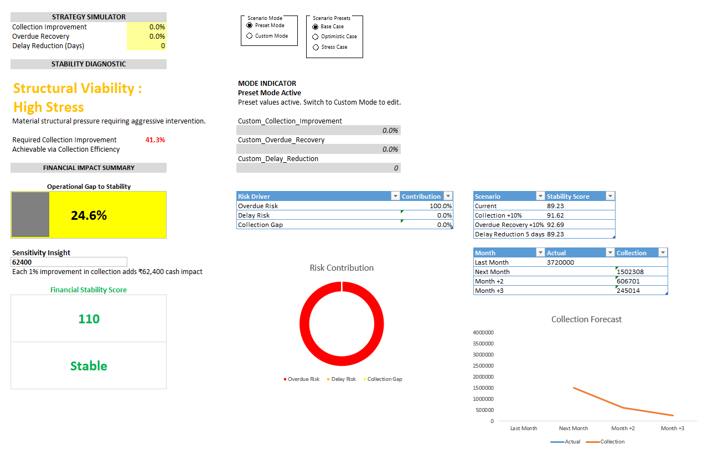

# 📊 Financial Stability Analytics Engine

## 🎯 Project Objective

The objective of this project was to design an analytical dashboard that converts installment payment data into operational and financial insights.

The system evaluates collection performance, identifies overdue risk and estimates how improvements in operational efficiency could influence financial stability.

## 📌 Project Overview

This project is an Excel-based financial analytics dashboard designed to simulate and monitor the financial stability of coaching institutes that collect student fees through installment payments.

The dashboard tracks revenue performance, installment collections, overdue risk and operational efficiency. It also includes a strategy simulation section that allows users to evaluate how improvements in collection performance could affect financial stability.

The project demonstrates how Excel can be used not only for reporting but also for financial analytics and operational diagnostics.

---

## ❓ Problem Statement

Many coaching institutes operate on installment-based fee structures. Delays in payments or high overdue balances can create serious cashflow instability.

The goal of this project was to build a dashboard that helps answer key questions:

- How much revenue is expected from active students?
- How much has been collected so far?
- How much revenue is still outstanding?
- Are collections happening efficiently?
- Is there a financial risk due to delayed payments?
- What improvements are needed to achieve financial stability?

The dashboard provides analytical insights to support better financial monitoring and decision-making.

---

## 📊 Dashboard Features

The dashboard is divided into multiple analytical sections:

### Revenue Performance
- Active Planned Revenue
- Total Collected Amount
- Total Outstanding Balance
- Projected Collection

### Operational Efficiency Metrics
- Collection Efficiency
- Realization Rate
- Average Payment Delay

### Risk Diagnostics
- Overdue Intensity
- Cashflow Risk Status
- Early Warning Indicators

### Financial Stability Assessment
- Structural Viability Indicator
- Operational Gap to Stability
- Financial Stability Score

---

## 📈 Key Metrics Explained

**Collection Efficiency**

Measures how effectively installment payments are being collected compared to the expected amount.

**Realization Rate**

Shows the percentage of planned revenue that has been successfully realized.

**Overdue Intensity**

Indicates the share of overdue installments relative to total expected payments.

**Average Payment Delay**

Measures the average delay between installment due date and actual payment date.

**Financial Stability Score**

A composite indicator designed to evaluate the financial health of the institute based on operational metrics.

---

## 🧠 Strategy Simulator

The dashboard also includes a strategy simulation section that models potential improvements in financial performance.

Users can simulate improvements in:

- Collection Efficiency
- Overdue Recovery
- Payment Delay Reduction

The simulator then estimates the impact on projected collections and financial stability.

This feature demonstrates how analytical dashboards can be used not only for monitoring but also for scenario planning.

---

## 🛠 Skills Used

- Microsoft Excel
- Advanced Excel Formulas
- Data Modeling
- Dashboard Design
- KPI Development
- Business Analytics

🔹 Key Excel functions used include:

- XLOOKUP
- INDEX
- LET
- EDATE
- IFERROR

---

## 🖼 Dashboard Screenshots

### Dashboard Overview

### Financial Metrics

### Strategy Simulator

---

## 👤 Author

**Aditya Patne**

Data Analyst focused on data analytics, business intelligence and dashboard design.

GitHub:  
https://github.com/adityapatne001

LinkedIn:  
https://www.linkedin.com/in/adityapatne001
